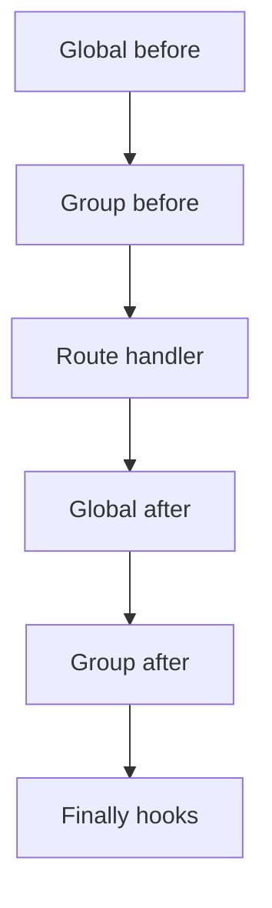

Middleware is request-scoped logic that runs around route handlers. Register it globally on `host.http` (`use`, `before`, `after`, `finally`) or inside a [route group](/core/http/routes/#groups) with the same APIs on the group builder (`g`). Controllers have no middleware slot; register hooks on the arc or group instead so they compile into the route pipeline.

Each hook returns `undefined` or `void` to leave the pipeline unchanged, or a non-`undefined` **override** (`MiddlewareOverride`: `void` or any `HandlerResult` except `null` or `undefined`) to replace what the next stage sees. A `FlareResponse` (or other `ResponseLike`) is the usual override when you want to send a response immediately.

Import types from `@flare-ts/core` when you want explicit signatures (builder callbacks infer these automatically):

```ts
import type {
  MiddlewareOverride,
  MiddlewareOptions,
  FlareHandlerScope,
  BeforeMiddlewareHandler,
  AfterMiddlewareHandler,
  FinallyMiddlewareHandler,
} from "@flare-ts/core";
```

`MiddlewareBase` is the class export. Handler aliases `MiddlewareBeforeFn`, `MiddlewareAfterFn`, and `MiddlewareFinallyFn` match `BeforeMiddlewareHandler`, `AfterMiddlewareHandler`, and `FinallyMiddlewareHandler`.

## Registration API

All registration methods live on `host.http` and on the group builder inside `host.http.group(prefix, g => { … })`.

| Method                                           | Purpose                                                                                                                                         |
| ------------------------------------------------ | ----------------------------------------------------------------------------------------------------------------------------------------------- |
| `use(Cls)`                                       | Register a class extending `MiddlewareBase`. At `host.build()`, the class must implement at least one of `before()`, `after()`, or `finally()`. |
| `before(handler)` / `before(options, handler)`   | Register a builder-style `before` hook (synthetic middleware).                                                                                  |
| `after(handler)` / `after(options, handler)`     | Register a builder-style `after` hook.                                                                                                          |
| `finally(handler)` / `finally(options, handler)` | Register a builder-style `finally` hook.                                                                                                        |
| `error(…)`                                       | Register error handlers for throws inside the pipeline. See [Error interaction](#error-interaction) and [HTTP errors](/core/http/errors/).      |

`use()` accepts only a `MiddlewareBase` subclass. Builder hooks accept a callback, optionally with [`MiddlewareOptions`](#middlewareoptions).

## Lifecycle hooks

| Hook      | Runs                                                                                                                                    | Builder signature                  | Class method                                                 | Short-circuit                                                                                                                                                       |
| --------- | --------------------------------------------------------------------------------------------------------------------------------------- | ---------------------------------- | ------------------------------------------------------------ | ------------------------------------------------------------------------------------------------------------------------------------------------------------------- |
| `before`  | Before the route handler (after global/group `before` predecessors)                                                                     | `(ctx, scope) => override`         | `before()` with `this.ctx`, `this.inject()`, `this.config()` | Return any non-`undefined` override (typically `new FlareResponse(…)`) to skip the handler and all `after` hooks. `finally` still runs.                             |
| `after`   | Only when the handler ran: not when `before` short-circuited, contract body validation failed inside the pipeline, or the handler threw | `(ctx, result, scope) => override` | `after(result)`                                              | Return a non-`undefined` override to replace `result`. Later `after` hooks still run against the updated value.                                                     |
| `finally` | Always after the handler path or error dispatch                                                                                         | `(ctx, result, scope) => override` | `finally(result)`                                            | Uncommon. Return a non-`undefined` override to replace the outgoing value before it leaves the pipeline. See [Execution order](#execution-order) for hook ordering. |

Class-based [`MiddlewareBase`](#class-style-middlewarebase) uses the same lifecycle names as instance methods. Builder callbacks receive a [`FlareHandlerScope`](/core/http/#registration-surface) as the last argument (`inject`, `config`).

All hooks may be `async`; returning a `Promise` is supported.

## MiddlewareOptions

Options for builder-style `before`, `after`, and `finally`:

| Option     | Purpose                                                                                                                                                 |
| ---------- | ------------------------------------------------------------------------------------------------------------------------------------------------------- |
| `inject`   | Service tokens available via `scope.inject()` in the callback (or declare on `static deps` for classes).                                                |
| `state`    | State tokens this hook reads. Compile-time verification ensures an upstream `before` hook `provides` each token.                                        |
| `provides` | State tokens written in a `before` hook. Required when downstream routes or middleware declare those tokens in `state`.                                 |
| `name`     | Display name for the synthetic middleware class (defaults to `SyntheticBeforeMiddleware`, `SyntheticAfterMiddleware`, or `SyntheticFinallyMiddleware`). |

A route or middleware that declares `state: [Token]` compiles only when an upstream **`before()`** hook provides each token (class `before()` or `host.http.before({ provides: [...] }, …)`). Middleware that only implements `after` or `finally` does not satisfy route `state`, even if `static provides` or `{ provides: [...] }` is set. Put token writes in `before()`.

## Class style: MiddlewareBase

`MiddlewareBase` extends [`FlareBase`](/core/http/routes/#controllers) and mirrors controller composition. Declare lifecycle as **`before()`**, **`after()`**, and **`finally()`** methods (not route decorators):

```ts
import {
  MiddlewareBase,
  FlareResponse,
  flareState,
  Logger,
} from "@flare-ts/core";

const AuthUser = flareState<{ id: string; }>("AuthUser");

class AuthMiddleware extends MiddlewareBase {
  public static override deps = [Logger];
  public static override state = [];
  public static override provides = [AuthUser];

  before() {
    const token = this.ctx.req.headers.get("authorization");
    if (!token) return this.unauthorized({ error: "missing token" });
    this.ctx.state.set(AuthUser, { id: "u1" });
  }

  finally() {
    this.inject(Logger).info("request done", {
      user: this.ctx.state.get(AuthUser)?.id,
    });
  }
}

host.http.use(AuthMiddleware);
```

### Required static members

| Member            | Required? | Purpose                                                    |
| ----------------- | --------- | ---------------------------------------------------------- |
| `static deps`     | Yes       | Services this middleware may `inject()` (`[]` if none).    |
| `static state`    | Yes       | State tokens this middleware reads (`[]` if none).         |
| `static provides` | Optional  | State tokens written in `before()` (`[]` or omit if none). |

Registration throws at call time if `deps` or `state` is missing, or if the argument is not a `MiddlewareBase` subclass. Missing lifecycle hooks throw at `host.build()`.

### Instance API

| Member               | Description                                                                               |
| -------------------- | ----------------------------------------------------------------------------------------- |
| `this.ctx`           | [`FlareHttpContext`](/core/http/request/) for the current request (`req`, `state`, etc.). |
| `this.inject(token)` | Resolve a service declared on `static deps`.                                              |
| `this.config(token)` | Resolve a config token declared on `static config` (optional on the class).               |

Optional lifecycle methods (implement any combination):

| Method            | Signature                                           |
| ----------------- | --------------------------------------------------- |
| `before()`        | `MiddlewareOverride \| Promise<MiddlewareOverride>` |
| `after(result)`   | `MiddlewareOverride \| Promise<MiddlewareOverride>` |
| `finally(result)` | `MiddlewareOverride \| Promise<MiddlewareOverride>` |

### Response helpers

Protected helpers on `MiddlewareBase` return a `ResponseLike` (always a `FlareResponse` in practice) with a fixed status:

| Method                  | Status |
| ----------------------- | ------ |
| `badRequest(body)`      | 400    |
| `unauthorized(body)`    | 401    |
| `forbidden(body)`       | 403    |
| `notFound(body)`        | 404    |
| `tooManyRequests(body)` | 429    |
| `error(body)`           | 500    |

Use these from `before()` to short-circuit with a typed response (for example `return this.tooManyRequests({ error: "rate limited" })`). Read request data from `this.ctx.req`. `MiddlewareBase` has no `this.req`.

## Builder style

For one-off hooks, register callbacks on the HTTP arc or group:

```ts
import { FlareResponse, flareState, Logger } from "@flare-ts/core";

const AuthUser = flareState<{ id: string; }>("AuthUser");

host.http.before({ provides: [AuthUser] }, (ctx) => {
  ctx.state.set(AuthUser, { id: "u1" });
});

host.http.after((_ctx, result, _scope) => {
  if (result instanceof FlareResponse) {
    result.headers.set("x-flare-version", "1.0");
  }
});

host.http.finally({ inject: [Logger] }, (_ctx, _result, scope) => {
  scope.inject(Logger).debug("finished");
});
```

Both class and builder styles can coexist on the same arc or group. Register group-scoped hooks inside `host.http.group(prefix, g => { g.before(...); return g.register(); })`.

## Execution order

Each route runs one middleware chain: only the hooks a registration implements (`before`, `after`, and/or `finally`) participate.

For a route inside a non-isolated group:



On each side of the handler, **global hooks run before group hooks**:

- **`before`:** globals (registration order, minus `exclude()`) → group replacements → other group-local `before` hooks → handler.
- **`after`:** globals (registration order, minus `exclude()`) → group replacements → other group-local `after` hooks.
- **`finally`:** group `finally` hooks (reverse registration order within the group), then global `finally` hooks (reverse registration order among globals). Every registered `finally` hook still runs even when an earlier hook throws or short-circuits.

Within a scope, `before` and `after` run in **registration order**. Within a scope, `finally` runs in **reverse registration order** (the hook you registered last in that scope runs first).

### Group middleware

| API                                       | Behavior                                                                                                                                                              |
| ----------------------------------------- | --------------------------------------------------------------------------------------------------------------------------------------------------------------------- |
| `g.use(Cls)`                              | Group-local `MiddlewareBase` subclass.                                                                                                                                |
| `g.before` / `g.after` / `g.finally`      | Group-local builder hooks.                                                                                                                                            |
| `g.isolated()`                            | Skip **all** global middleware for routes in this group. Register needed middleware with `g.use` or group-scoped builder hooks instead of relying on `host.http.use`. |
| `g.exclude([SomeMiddleware])`             | Remove specific global middleware classes from this group's routes. Throws at `host.build()` if an excluded class was never registered globally.                      |
| `g.replace(OldMiddleware, NewMiddleware)` | Equivalent to excluding `OldMiddleware` and prepending `NewMiddleware` to the group chain (after remaining globals).                                                  |

Group middleware runs only for routes registered inside that group. Routes on `host.http` outside the group never see group middleware.

### Routes without middleware

- **`g.isolated()` groups:** no global middleware.
- **Route `{ isolated: true }`:** that route's pipeline has no middleware (see [Routes](/core/http/routes/)).

Route and [query contract](/core/http/contracts/) validation runs before the pipeline starts, so middleware never runs when those checks fail. Request body validation runs **inside** the pipeline (after `before` hooks), so a body `400` skips the handler and `after` hooks but still runs `finally`.

## Short-circuit rules

- **`before` returns a non-`undefined` override:** the handler and all `after` hooks are skipped. The override flows through `finally` hooks and becomes the client response after normalization.
- **`after` returns a non-`undefined` override:** replaces the handler result. Later `after` hooks still run unless they also return a replacement.
- **`finally` returns a non-`undefined` override:** replaces the value leaving the pipeline.

```ts
before() {
  if (overLimit(this.ctx.req)) {
    return new FlareResponse(429, { error: "rate limited" });
  }
  // no return = continue
}
```

## Error interaction

Throws and rejected promises inside middleware hooks are handled the same way as handler throws. Register handlers with `host.http.error(…)` and, for group routes, `g.error(…)`.

See [HTTP errors](/core/http/errors/) for registration, `ErrorHandlerBase`, and responses that bypass error handlers (404, 405, contract `400` at the router layer, etc.). Middleware-specific behavior:

| Event                                | Handler ran?                         | `after` runs?                   | `finally` runs?                                        |
| ------------------------------------ | ------------------------------------ | ------------------------------- | ------------------------------------------------------ |
| `before` throws or rejects           | No                                   | No                              | Yes (on the dispatched response)                       |
| `before` returns a response override | No                                   | No                              | Yes (on the override)                                  |
| Handler throws                       | Yes (then error dispatch)            | No                              | Yes                                                    |
| `after` throws or rejects            | Yes (handler completed)              | Remaining `after` hooks skipped | Yes                                                    |
| `finally` throws or rejects          | Yes, unless `before` short-circuited | N/A                             | **Remaining** `finally` hooks still run after dispatch |

When every error handler defers or fails, Flare falls back to a `FlareError`-aware or generic `500` response (see [HTTP errors](/core/http/errors/#what-is-caught)).

Group routes use arc-level error handlers first, then group handlers registered with `g.error()`. Isolated groups still use arc-level handlers; isolation affects middleware only, not the error-handler chain.

A `finally` hook that throws does not abort the rest of the `finally` chain. The error is dispatched, then the next `finally` index runs.

## Related

- [State](/core/http/state/): `provides`, `ctx.state`, compile-time wiring
- [Routes](/core/http/routes/): groups, `{ isolated: true }` routes
- [HTTP errors](/core/http/errors/): error handler registration and fallback behavior
- [Routing reference](/core/http/routing-reference/): OPTIONS/CORS preflight (runs before the middleware pipeline)
- [Failure modes](/core/failure-modes/): `DEAD_MIDDLEWARE`, `MIDDLEWARE_STATE_CYCLE`, compile-time state errors
