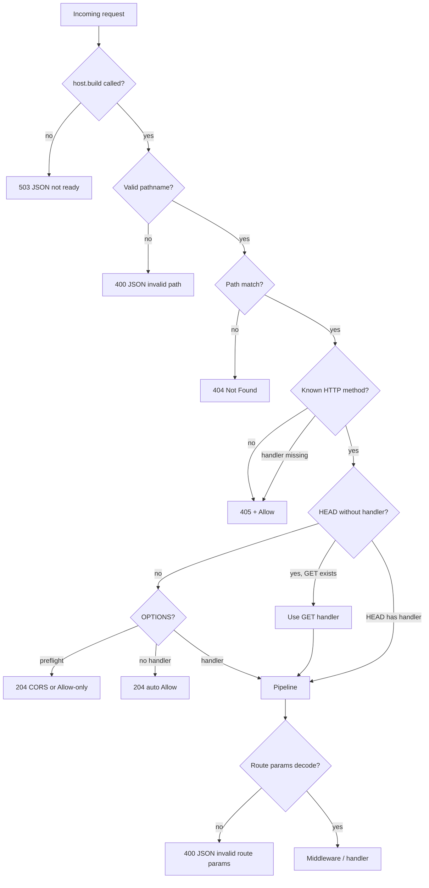

This page is the runtime behavior reference for HTTP routing and method dispatch after `host.build()`. Registration APIs live in [Routes](/core/http/routes/).

For request parsing, response shapes, and body limits, see [Request](/core/http/request/) and [Response](/core/http/response/).

## Overview

Each registered path becomes one **pipeline**: a single match target shared by every HTTP method you registered on that path. `host.build()` compiles all pipelines, sorts them by specificity, and builds a path matcher. On each request, Flare:

1. Matches the request pathname (no query string).
2. Resolves the HTTP method (including HEAD fallback and OPTIONS shortcuts).
3. Extracts route parameters (when the path matched and a handler will run).
4. Runs middleware and the handler.

Malformed pathnames return **400** and an unbuilt host returns **503** before step 1. Steps 1–2 can return **404**, **405**, or **204** (OPTIONS/CORS) without running middleware or handlers. Step 3 can return **400** when captured segments contain malformed percent-encoding (see [URL decoding](#url-decoding-after-match)). `host.http.error()` only handles errors thrown inside a matched pipeline; it does not run for unmatched paths or [inbound path validation](#inbound-path-rules) failures.

If `host.build()` has not run, every request gets **503** with JSON body `{ "error": "Application not ready. Call host.build() before handling requests." }`.

## Path composition

Final route paths are built in two steps at registration time.

### Group and controller prefixes

Inside `host.http.group(prefix, …)`, every route and controller path is prefixed with the group `prefix` by string concatenation (`prefix + path`). The group prefix and route path are not normalized together, so both must be valid absolute segments (typically `prefix` is `/api/v1` and routes start with `/…`).

| Registration                                             | Effective controller base |
| -------------------------------------------------------- | ------------------------- |
| Arc: `host.http.get("/health", …)`                       | `/health`                 |
| Group: `g.get("/health", …)` with `prefix` `/v1`         | `/v1/health`              |
| Arc: `host.http.controller("/users", Cls)`               | `/users`                  |
| Group: `g.controller("/users", Cls)` with `prefix` `/v1` | `/v1/users`               |
| Group: `g.controller("", Cls)` with `prefix` `/v1`       | `/v1`                     |

Groups do not nest (the group builder has no `group()`). Use one group with the full prefix you need (for example `/api/v1`) or register routes at the arc level instead of stacking groups.

### Controller mount + decorator path

For controller classes, the handler path from `@Get`, `@Post`, etc. is joined to the controller mount point:

| Controller base | Decorator path       | Effective route            |
| --------------- | -------------------- | -------------------------- |
| `/users`        | `""` (omit argument) | `/users` (controller root) |
| `/users`        | `/:id`               | `/users/:id`               |
| `/`             | `/health`            | `/health`                  |
| `/api`          | `/v1/users`          | `/api/v1/users`            |

Use `""` (not `"/"`) for a controller root route. Passing `"/"` to a decorator throws at decoration time.

## Segment syntax

Paths must start with `/`. Paths must not end with `/` except the lone path `/`. Paths must not contain empty segments (`//`). The same rules apply to group prefixes at registration time and to inbound request pathnames at runtime (invalid inbound paths return **400**; see [Inbound path rules](#inbound-path-rules)).

| Segment form                | Meaning                                               | Specificity score                |
| --------------------------- | ----------------------------------------------------- | -------------------------------- |
| Literal (`users`, `v1`)     | Exact segment text                                    | +2 per segment                   |
| Parameter (`:id`, `:name`)  | One path segment; name must be a valid identifier     | +1 per segment                   |
| Wildcard (`*path`, `*rest`) | Final segment only; captures the rest of the pathname | +0 (wildcard segment not scored) |

Build-time validation rejects:

- `:` or `*` without a name (`ROUTE_MISSING_PARAM_NAME`, `ROUTE_MISSING_WILDCARD_NAME`)
- Invalid parameter names (`ROUTE_INVALID_PARAM_NAME`)
- Wildcard not in the last position (`ROUTE_WILDCARD_NOT_LAST`)
- Duplicate parameter names on one path (`DUPLICATE_ROUTE_PARAM`)
- Same structural pattern with different parameter names across handlers (`DUPLICATE_ROUTE_PATTERN`)
- The same HTTP method registered twice on the same full path (`DUPLICATE_ROUTE_METHOD` or registration-time throw)
- The same exact path spread across separate controller registrations (`DUPLICATE_ROUTE_PIPELINE`)

Up to **1024** distinct paths per host. Exceeding that throws during `host.build()`.

## Specificity and tie-breaking

At build time, each path gets a **specificity score**: sum of per-segment weights (literal 2, param 1, wildcard 0). Higher score wins when multiple patterns could match the same request path.

When two paths tie on score, **registration order** breaks the tie. Earlier registration keeps higher priority. That order is fixed at `host.build()` and does not change per request.

Example: for request `/files/readme.txt`, `/files/readme.txt` (literals) beats `/files/:name` (param) beats `/files/*path` (wildcard) when all three are registered.

## Path matching at runtime

At `host.build()`, Flare merges methods per path into pipelines, assigns each path a specificity score, and sorts routes from most specific to least. When a request arrives:

- Matching uses `ctx.req.path` — pathname only (query string stripped, **no** percent-decoding before the match).
- Malformed inbound pathnames are rejected before matching (see [Inbound path rules](#inbound-path-rules)).
- Among routes that could match the same pathname, the highest-specificity route wins. When scores tie, earlier registration wins.
- Matching is **case-sensitive** on the raw pathname bytes.
- Literal segments outrank parameters; parameters outrank wildcards when multiple patterns could match the same pathname.

Matching does **not** decode `%` sequences; `%20` in the URL is two characters `%`, `2`, `0`, not a space, for literal segments. Handlers receive route params after extraction completes in the same request turn.

## Inbound path rules

Before matching, Flare validates the inbound pathname from `ctx.req.path`. The same shape rules apply at registration time (decorators and `host.build()` validation throw instead of returning 400). Reject the request with **400** and this JSON body when validation fails:

```json
{
  "error": "Invalid request path. Paths must start with \"/\", must not contain empty segments (\"//\"), and must not end with a trailing slash except for \"/\"."
}
```

| Rule                        | Example invalid       | Example valid |
| --------------------------- | --------------------- | ------------- |
| Must start with `/`         | `users`, `""` (empty) | `/users`      |
| No trailing `/` except root | `/users/`             | `/users`, `/` |
| No empty segments (`//`)    | `/a//b`, `//users`    | `/a/b`        |

`/users/` does **not** fall through to `/users`. Register both paths explicitly if you need both shapes (not recommended). No middleware or handler runs for invalid pathnames.

## URL decoding (after match)

Captured values are taken from the request pathname substring and passed through `decodeURIComponent` before exposure:

| Source                | Where it appears                                                                             |
| --------------------- | -------------------------------------------------------------------------------------------- |
| Always                | `ctx.req.rawRouteParams` (`Record<string, string>`)                                          |
| With a route contract | Typed `route` fields from `ctx.extract(descriptor)` (see [Contracts](/core/http/contracts/)) |

Rules:

- **`:param`**: one segment; decode the segment substring.
- **`*wildcard`**: from the wildcard segment start through the end of the pathname; decode the full remainder (may include `/` after decoding).
- **Literals**: not decoded as a unit; the path must match the registered literal bytes. A route `/files/a b` does not match `GET /files/a%20b`, but `/files/:name` does and yields `name: "a b"`.

If decoding throws (malformed `%` sequence), Flare returns **400** with JSON:

```json
{
  "error": "Invalid route parameters. Check that your URL path matches the expected format."
}
```

No middleware or handler runs for that request.

## Supported methods

Flare dispatches these methods: **GET**, **POST**, **PUT**, **PATCH**, **DELETE**, **HEAD**, **OPTIONS**.

Any other method (for example `TRACE`) on a matched path returns **405** with the same `Allow` rules as a supported but unregistered method.

Method names are matched as received on the wire (typical servers send uppercase).

## Path not found (404)

When no pipeline matches the pathname:

| Field          | Value                                              |
| -------------- | -------------------------------------------------- |
| Status         | `404`                                              |
| Body           | Plain text `Not Found`                             |
| `Content-Type` | `text/plain` (set automatically for string bodies) |

This is not routed through `host.http.error()`. For a custom 404, register a low-specificity catch-all such as `host.http.get("/*path", …)` so a pipeline always matches and your handler returns the response you want.

## Method not allowed (405)

When the path matches a pipeline but the method cannot be served:

| Field   | Value                                                               |
| ------- | ------------------------------------------------------------------- |
| Status  | `405`                                                               |
| Body    | Plain text `Method Not Allowed`                                     |
| `Allow` | Comma-separated list of methods that **have handlers** on that path |

`Allow` construction:

- Includes each supported method with a registered handler on that path, in fixed order (`GET`, `POST`, `PUT`, `PATCH`, `DELETE`, `HEAD`, `OPTIONS`; only methods with handlers appear).
- Adds **HEAD** when a **GET** handler exists, even if there is no explicit HEAD registration (HEAD is discoverable as an alias of GET).
- Does **not** include **OPTIONS**, even if routes use CORS (synthetic OPTIONS responses are separate).

Example: `GET`, `POST`, and `DELETE` registered → `Allow: GET, POST, DELETE, HEAD`.

Unsupported methods (not in the supported list) use the same 405 response when the path matched.

## HEAD fallback

When the path matches and the request method is **HEAD**:

1. If an explicit HEAD handler is registered, it runs.
2. Otherwise, if a GET handler exists, Flare runs the GET handler and returns a response with the same **status** and **headers** but a **null body** ([RFC 9110 §9.3.2](https://www.rfc-editor.org/rfc/rfc9110#name-head)).

Register `host.http.head(…)` or `@Head` when HEAD must differ from GET without duplicating GET logic.

HEAD fallback runs middleware and route-parameter extraction like GET.

## OPTIONS and CORS

OPTIONS is handled in the method-dispatch layer before your OPTIONS handler or `before` middleware when the shortcuts below apply.

### CORS preflight

A request is treated as a **CORS preflight** when **all** of the following hold:

- Request method is `OPTIONS`
- Path matched a pipeline
- That pipeline has a CORS policy (from `host.http.cors()` or `g.cors()` on the group that owns the route)
- Request includes header `Origin`
- Request includes header `Access-Control-Request-Method`

Preflight is answered **before** any explicit `OPTIONS` handler, `before` middleware, or route-parameter extraction.

| Outcome        | Status | Body  | Notable headers                                                                                                                                                                                        |
| -------------- | ------ | ----- | ------------------------------------------------------------------------------------------------------------------------------------------------------------------------------------------------------ |
| Origin allowed | `204`  | empty | `Access-Control-Allow-Origin`, `Access-Control-Allow-Methods`, `Access-Control-Max-Age`, optional `Access-Control-Allow-Headers`, optional `Access-Control-Allow-Credentials`, optional `Vary: Origin` |
| Origin denied  | `204`  | empty | `Allow` only (same rules as auto-Allow below); **no** `Access-Control-Allow-Origin` (not 403)                                                                                                          |

`Access-Control-Allow-Methods` comes from `CorsConfig.methods` when set (comma-joined in array order); otherwise it is derived at `build()` from handlers on that path in the same fixed method order as `Allow` (including HEAD when GET exists, and OPTIONS).

Function-based `origins` policies may resolve asynchronously; preflight waits for that check.

### Auto-Allow OPTIONS (non-preflight)

When the request is `OPTIONS` but **not** a CORS preflight (missing `Origin`, missing `Access-Control-Request-Method`, or no CORS policy on the pipeline), and **no** explicit OPTIONS handler is registered:

| Field            | Value                                                                            |
| ---------------- | -------------------------------------------------------------------------------- |
| Status           | `204`                                                                            |
| Body             | empty                                                                            |
| `Allow`          | Registered methods on that path, plus **HEAD** when GET exists, plus **OPTIONS** |
| `Content-Length` | `0`                                                                              |

### Explicit OPTIONS handler

Register `host.http.options(…)` or `@Options` for OPTIONS behavior you control (for example method discovery without `Access-Control-Request-Method`). That handler runs in the normal pipeline (middleware, params, handler) when preflight rules did not short-circuit.

Synthesis applies only when OPTIONS is not registered on that path.

## Dispatch order (summary)



## Related

- [Routes](/core/http/routes/): registration, groups, controllers
- [Middleware](/core/http/middleware/): ordering and short-circuit rules
- [Contracts](/core/http/contracts/): coercion after route match
- [HTTP errors](/core/http/errors/): `host.http.error` and in-pipeline failures
